# v0.2.0 Critical Path Diagram

This diagram shows the dependency graph for v0.2.0 implementation. Items on the critical path are highlighted.

## Dependency Graph


## Critical Path Breakdown

**Total Critical Path Time**: ~85 hours (2.1 weeks at 40 hours/week)

### Path Items (MUST complete for release)

1. **#2 + #3: Fix Bugs** (Day 1)
   - Time: 4-6 hours
   - Blockers: None
   - Blocks: Everything else
   - Risk: Low (straightforward fixes)

2. **#4: Structured Logging** (Day 2)
   - Time: 6-8 hours
   - Blockers: #3 (test fix)
   - Blocks: #5, #6 (debugging)
   - Risk: Low (well-defined)

3. **#5: Session Locks** (Day 3)
   - Time: 6-8 hours
   - Blockers: #4 (logging helps debug)
   - Blocks: #6 (persistence needs locks)
   - Risk: Medium (concurrency is tricky)

4. **#6: Persistent Index** (Days 4-5)
   - Time: 12-16 hours
   - Blockers: #5 (needs locks)
   - Blocks: #8 (integration testing)
   - Risk: Medium (largest feature)
   - **Longest single task on critical path**

5. **#8: Integration Testing** (Day 6)
   - Time: 8 hours
   - Blockers: #6 (needs all features)
   - Blocks: #9 (docs), #11 (release)
   - Risk: High (may find issues)

6. **#9: Documentation** (Days 8-9)
   - Time: 12 hours
   - Blockers: #8 (features must work)
   - Blocks: #11 (release needs docs)
   - Risk: Low (time-consuming but straightforward)

7. **#11: Release** (Days 12-14)
   - Time: 16 hours (includes alpha testing)
   - Blockers: #9, #10
   - Blocks: Nothing (end of path)
   - Risk: Medium (alpha testing may find issues)

### Off-Critical-Path Items (Can parallelize or defer)

**#7: Batch Loading** (Day 7)
- Time: 6-8 hours
- Can work in parallel with documentation
- Can defer to v0.2.1 if needed
- Not blocking release

**#10: Benchmarks** (Day 11)
- Time: 6-8 hours
- Can work in parallel with alpha testing
- Could be shortened to basic perf check
- Not strictly blocking release

## Parallel Work Opportunities

If you have 2 developers:

### Week 1
- **Dev A**: #2, #3, #4 (bugs + logging)
- **Dev B**: Study codebase, prepare for #5

### Week 2
- **Dev A**: #5, #6 (locks + persistence)
- **Dev B**: #7 (batch loading - independent)

### Week 3
- **Dev A**: #8, #9 (testing + docs)
- **Dev B**: #10, alpha testing setup

### Final Days
- **Both**: #11 (release prep together)

## Fast-Track Option (Cut Scope)

If timeline is tight, **cut #7** (batch loading) and defer to v0.2.1:

```mermaid
graph TD
    Start[Start v0.2.0] --> Patches[#2 + #3: Fix Bugs<br/>Day 1: 4-6h]
    Patches --> Logging[#4: Logging<br/>Day 2: 6-8h]
    Logging --> Locks[#5: Locks<br/>Day 3: 6-8h]
    Locks --> Index[#6: Index Persist<br/>Days 4-5: 12-16h]
    Index --> Test[#8: Testing<br/>Day 6: 8h]
    Test --> Docs[#9: Docs<br/>Days 7-8: 12h]
    Docs --> Release[#11: Release<br/>Days 9-10: 16h]
    Release --> Done[v0.2.0 ✅<br/>10 days total]

    classDef critical fill:#ff6b6b,stroke:#c92a2a,stroke-width:3px,color:#fff
    class Patches,Logging,Locks,Index,Test,Docs,Release critical
```



**Result**: 10 days instead of 14 days (30% faster)

## Risk Analysis by Path Stage

### High-Risk Stages (likely to cause delays)

1. **#6: Persistent Index** (Days 4-5)
   - Why risky: Most complex feature, many edge cases
   - Mitigation: Start early, allocate extra time buffer
   - Contingency: Simplify staleness detection if needed

2. **#8: Integration Testing** (Day 6)
   - Why risky: May discover integration issues
   - Mitigation: Continuous testing during development
   - Contingency: Add 1-2 days buffer for fixes

3. **#11: Alpha Testing** (Days 12-13)
   - Why risky: Real users may find unexpected issues
   - Mitigation: Internal testing before alpha
   - Contingency: Have hotfix day budgeted

### Medium-Risk Stages

4. **#5: Session Locks** (Day 3)
   - Why risky: Concurrency bugs are subtle
   - Mitigation: Extensive concurrency tests
   - Contingency: Fall back to simpler locking if issues

### Low-Risk Stages

5. **#2, #3: Bug Fixes** (Day 1)
   - Straightforward, well-understood

6. **#4: Structured Logging** (Day 2)
   - Well-defined, no complex dependencies

7. **#9: Documentation** (Days 8-9)
   - Time-consuming but not technically risky

## Timeline with Buffers

| Week | Days | Critical Path Item | Buffer |
|------|------|-------------------|--------|
| 1 | 1 | Bug fixes | +0 days |
| 1 | 2 | Logging | +0 days |
| 1 | 3 | Locks | +0.5 days |
| 1 | 4-5 | Index persistence | **+1 day** |
| 2 | 6 | Integration testing | **+1 day** |
| 2 | 7 | (Optional: Batch load) | - |
| 2 | 8-9 | Documentation | +0.5 days |
| 3 | 10 | Code review | +0 days |
| 3 | 11 | Benchmarks | +0 days |
| 3 | 12-13 | Alpha testing | **+1 day** |
| 3 | 14 | Release | +0 days |

**Total buffer**: 4 days built into 14-day schedule

**If everything goes perfect**: Ship in 10 days
**If moderate issues**: Ship in 14 days (plan)
**If significant issues**: Ship in 18 days (with buffers)

## Bottleneck Analysis

### Single-Developer Bottlenecks

**Bottleneck #1: Days 4-5 (Index Persistence)**
- Longest uninterruptible task
- Can't parallelize within task
- Solutions:
  - Start early
  - Break into sub-tasks if possible
  - Have code review after Day 4

**Bottleneck #2: Days 12-13 (Alpha Testing)**
- Waiting on external feedback
- Can't rush without risking quality
- Solutions:
  - Line up alpha users in advance
  - Have clear test scenarios ready
  - Set expectations (24-48 hour turnaround)

### Resource Constraints

**Developer Time**
- 100-120 hours total
- Can't compress below ~10 days (human limits)
- Solution: Add second developer for 30% speedup

**External Dependencies**
- Alpha user availability
- PyPI publishing access
- Documentation review time
- Solution: Prepare all prerequisites in advance

## Schedule Optimization

### Fastest Possible (with 2 devs)

```
Week 1: 5 days
  Day 1: Bugs (Dev A), Study (Dev B)
  Day 2-3: Logging + Locks (Dev A), Batch prep (Dev B)
  Day 4-5: Index (Dev A), Batch loading (Dev B)

Week 2: 4 days
  Day 6-7: Testing (Dev A), Docs start (Dev B)
  Day 8: Docs finish (both)
  Day 9: Review + Benchmarks (both)

Week 3: 3 days
  Day 10-11: Alpha testing (both monitor)
  Day 12: Release (both)
```

**Total**: 12 days with 2 developers

### Most Realistic (solo)

```
Week 1: 5 days
  Mon: Bugs + logging start
  Tue: Logging finish + locks
  Wed-Thu: Index persistence
  Fri: Buffer / catch-up

Week 2: 5 days
  Mon: Integration testing
  Tue-Wed: Documentation
  Thu: Batch loading
  Fri: Code review + cleanup

Week 3: 4 days
  Mon: Benchmarks
  Tue-Wed: Alpha testing + fixes
  Thu: Release
```

**Total**: 14 days (3 weeks) - matches plan

## Decision Points

At each stage, decide go/no-go:

### Day 5 End: Index Persistence Complete?
- ✅ **GO**: All tests pass, performance acceptable → Continue
- ❌ **NO-GO**: Major issues → Add Day 6 buffer, push everything +1 day

### Day 6 End: Integration Tests Pass?
- ✅ **GO**: All tests pass → Continue to docs
- ⚠️ **ISSUES**: Some failures → Spend Day 7 fixing, defer batch loading
- ❌ **NO-GO**: Critical failures → Re-evaluate, possibly cut scope

### Day 9 End: Documentation Complete?
- ✅ **GO**: Docs reviewed and accurate → Continue to alpha
- ⚠️ **INCOMPLETE**: Need another day → Use Day 10 buffer

### Day 13 End: Alpha Approval?
- ✅ **GO**: Alpha users approve → Release Day 14
- ⚠️ **MINOR ISSUES**: Fix Day 14, release Day 15
- ❌ **MAJOR ISSUES**: Delay 1 week, fix issues, re-test

## Success Metrics by Stage

Track these to know if you're on track:

| Stage | Metric | Target |
|-------|--------|--------|
| Day 1 | Bugs fixed, tests pass | 100% |
| Day 2 | Logging tests pass | 100% |
| Day 3 | Concurrency tests pass | 100% |
| Day 5 | Index persistence tests pass | 100% |
| Day 5 | Index save/load time | <100ms |
| Day 6 | All integration tests pass | 100% |
| Day 9 | Docs reviewed | 1 reviewer |
| Day 11 | Benchmarks complete | All recorded |
| Day 13 | Alpha user approval | 2+ users |
| Day 14 | Release published | PyPI live |

## Contingency Triggers

**If any of these happen, activate contingency plan:**

1. **Day 5**: Index persistence tests <80% passing
   - **Action**: Add 2-day buffer, defer batch loading to v0.2.1

2. **Day 6**: Integration tests reveal architectural issue
   - **Action**: Stop, re-design, extend timeline 1 week

3. **Day 9**: Documentation not ready
   - **Action**: Cut benchmarks, focus on docs, ship without perf data

4. **Day 13**: Alpha users report critical bug
   - **Action**: Fix immediately, delay release 2-3 days

5. **Day 14**: Release process fails (PyPI, etc.)
   - **Action**: Debug, document issue, release next day

## Post-Mortem Tracking

After release, track actual vs. planned:

| Item | Planned | Actual | Variance | Notes |
|------|---------|--------|----------|-------|
| #2 Fix Bugs | 4h | ___ | ___ | ___ |
| #3 Fix Tests | 2h | ___ | ___ | ___ |
| #4 Logging | 7h | ___ | ___ | ___ |
| #5 Locks | 7h | ___ | ___ | ___ |
| #6 Index | 14h | ___ | ___ | ___ |
| #8 Testing | 8h | ___ | ___ | ___ |
| #9 Docs | 12h | ___ | ___ | ___ |
| #11 Release | 16h | ___ | ___ | ___ |
| **Total** | **70h** | **___** | **___** | **___** |

Use this data to improve estimates for v0.3.0!

---

## Visual Summary

### Critical Path (Must Complete)
```
Bugs → Logging → Locks → Index → Testing → Docs → Release
(85 hours total, 10-14 days)
```

### Off-Path (Can Defer)
```
Batch Loading (6-8 hours, can be v0.2.1)
Benchmarks (6-8 hours, can be minimal)
```

### Risk Heat Map
```
🟢 Low Risk:    Bugs, Logging, Docs
🟡 Medium Risk: Locks, Benchmarks
🔴 High Risk:   Index, Testing, Alpha
```

### Resource Allocation
```
Week 1: 70% dev, 20% testing, 10% planning
Week 2: 50% dev, 30% testing, 20% docs
Week 3: 20% dev, 30% testing, 50% release prep
```

---

**Use this diagram to**:
- Track progress daily
- Identify blockers early
- Make go/no-go decisions
- Communicate status to stakeholders
- Plan resource allocation
