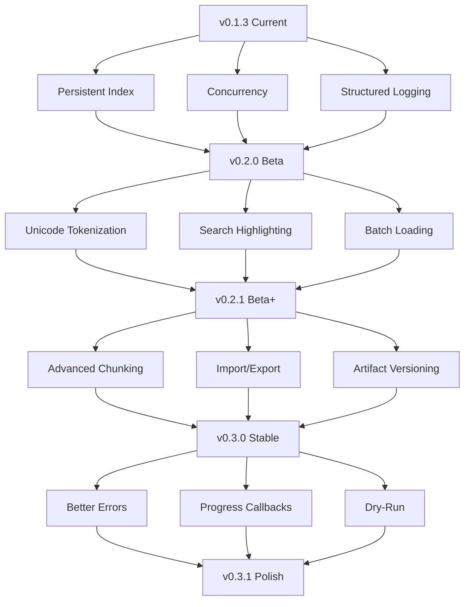

# RLM-MCP Solution Design
**Version**: v0.2.0 - v0.4.0 Roadmap
**Date**: 2026-01-15

## Table of Contents
- [Priority 1: Production Readiness](#priority-1-production-readiness)
- [Priority 2: Performance Optimization](#priority-2-performance-optimization)
- [Priority 3: Feature Enhancements](#priority-3-feature-enhancements)
- [Priority 4: Developer Experience](#priority-4-developer-experience)
- [Implementation Plan](#implementation-plan)

---

# Priority 1: Production Readiness

**Target**: v0.2.0 (Beta Release)
**Timeline**: 2-3 weeks
**Goal**: Make system ready for multi-user team environments

## 1.1 Persistent BM25 Index

### Problem Statement
Currently, BM25 indexes are built in-memory on first search query and cached in `RLMServer._index_cache`. When the server restarts, indexes are lost and must be rebuilt. For sessions with large corpora (1M+ chars), index rebuilding adds significant latency to the first query.

### Solution Architecture

#### Storage Format
```
~/.rlm-mcp/
  indexes/
    {session_id}/
      bm25.pkl         # Serialized BM25 index
      metadata.json    # Index version, created_at, doc_count
```

#### Index Lifecycle
1. **Build**: First search query builds index in-memory (current behavior)
2. **Persist**: On session.close or explicit save, serialize to disk
3. **Load**: On server start or first query, check for persisted index
4. **Invalidate**: On docs.load, delete persisted index and clear cache

#### Implementation Approach

**File**: `src/rlm_mcp/index/persistence.py` (new)
```python
from pathlib import Path
import pickle
import json
from typing import Any
from datetime import datetime

class IndexPersistence:
    """Handles BM25 index serialization and loading."""

    def __init__(self, data_dir: Path):
        self.index_dir = data_dir / "indexes"
        self.index_dir.mkdir(exist_ok=True)

    def save_index(
        self,
        session_id: str,
        index: Any,
        doc_count: int
    ) -> None:
        """Persist index to disk."""
        session_dir = self.index_dir / session_id
        session_dir.mkdir(exist_ok=True)

        # Save index
        index_path = session_dir / "bm25.pkl"
        with open(index_path, 'wb') as f:
            pickle.dump(index, f, protocol=pickle.HIGHEST_PROTOCOL)

        # Save metadata
        metadata = {
            "version": "1.0",
            "created_at": datetime.utcnow().isoformat(),
            "doc_count": doc_count,
            "index_type": "bm25"
        }
        metadata_path = session_dir / "metadata.json"
        with open(metadata_path, 'w') as f:
            json.dump(metadata, f, indent=2)

    def load_index(self, session_id: str) -> tuple[Any, dict] | None:
        """Load index from disk if exists."""
        session_dir = self.index_dir / session_id
        index_path = session_dir / "bm25.pkl"
        metadata_path = session_dir / "metadata.json"

        if not index_path.exists():
            return None

        # Load metadata
        with open(metadata_path, 'r') as f:
            metadata = json.load(f)

        # Load index
        with open(index_path, 'rb') as f:
            index = pickle.load(f)

        return index, metadata

    def invalidate_index(self, session_id: str) -> None:
        """Delete persisted index."""
        session_dir = self.index_dir / session_id
        if session_dir.exists():
            import shutil
            shutil.rmtree(session_dir)
```

**Changes to**: `src/rlm_mcp/server.py`
```python
from rlm_mcp.index.persistence import IndexPersistence

class RLMServer:
    def __init__(self, config: ServerConfig | None = None):
        # ... existing code ...
        self.index_persistence = IndexPersistence(Path(self.config.data_dir))

    async def get_or_build_index(
        self,
        session_id: str
    ) -> tuple[Any, bool]:
        """Get cached index or load from disk or build new.

        Returns:
            (index, built_this_call)
        """
        # Check in-memory cache first
        if session_id in self._index_cache:
            return self._index_cache[session_id], False

        # Try loading from disk
        persisted = self.index_persistence.load_index(session_id)
        if persisted is not None:
            index, metadata = persisted

            # Verify doc count matches (detect stale index)
            session = await self.db.get_session(session_id)
            doc_count = await self.db.count_documents(session_id)

            if metadata["doc_count"] == doc_count:
                # Cache and return
                self._index_cache[session_id] = index
                return index, False
            else:
                # Stale index, delete it
                self.index_persistence.invalidate_index(session_id)

        # Build new index (will be called from search.py)
        return None, True
```

**Changes to**: `src/rlm_mcp/tools/search.py`
```python
async def _search_query(...):
    # ... existing validation ...

    # Get or build index
    index, built_this_call = await server.get_or_build_index(session_id)

    if index is None:
        # Build new index
        docs = await server.db.get_documents_by_session(session_id)
        # ... build index ...
        server._index_cache[session_id] = index
        built_this_call = True

    # ... perform search ...

    return {
        "matches": matches,
        "index_built": True,
        "index_built_this_call": built_this_call,
    }
```

**Changes to**: `src/rlm_mcp/tools/session.py`
```python
async def _session_close(...):
    # ... existing code ...

    # Persist index if exists
    if session_id in server._index_cache:
        doc_count = await server.db.count_documents(session_id)
        server.index_persistence.save_index(
            session_id,
            server._index_cache[session_id],
            doc_count
        )
        del server._index_cache[session_id]

    # ... rest of close logic ...
```

**Changes to**: `src/rlm_mcp/tools/docs.py`
```python
async def _docs_load(...):
    # ... existing load logic ...

    # Invalidate cached and persisted index
    if session_id in server._index_cache:
        del server._index_cache[session_id]
    server.index_persistence.invalidate_index(session_id)

    # ... return result ...
```

### Testing Strategy

**File**: `tests/test_index_persistence.py` (new)
```python
@pytest.mark.asyncio
async def test_index_persists_on_close(server: RLMServer):
    """Test that index is saved to disk on session.close."""
    session = await _session_create(server, name="persist-test")
    session_id = session["session_id"]

    # Load docs and build index
    await _docs_load(server, session_id=session_id, sources=[...])
    await _search_query(server, session_id=session_id, query="test")

    # Close session (should persist)
    await _session_close(server, session_id=session_id)

    # Verify index file exists
    index_path = server.index_persistence.index_dir / session_id / "bm25.pkl"
    assert index_path.exists()

@pytest.mark.asyncio
async def test_index_loads_on_restart(server: RLMServer):
    """Test that index loads from disk after restart."""
    # Build and persist index in first session
    # ... (similar to above) ...

    # Simulate restart by clearing cache
    server._index_cache.clear()

    # Next search should load from disk (not rebuild)
    result = await _search_query(server, session_id=session_id, query="test")
    assert not result["index_built_this_call"]  # Loaded, not built

@pytest.mark.asyncio
async def test_index_invalidates_on_doc_load(server: RLMServer):
    """Test that index is deleted when new docs loaded."""
    # Build and persist
    # ...

    # Load new doc (should invalidate)
    await _docs_load(server, session_id=session_id, sources=[...])

    # Index file should be deleted
    index_path = server.index_persistence.index_dir / session_id / "bm25.pkl"
    assert not index_path.exists()
```

### Migration Path
- **v0.1.3 → v0.2.0**: No breaking changes, transparent upgrade
- Existing sessions continue to work (index rebuilt on first query)
- New sessions benefit from persistence immediately

### Configuration
```yaml
# ~/.rlm-mcp/config.yaml
index_persistence_enabled: true  # Default true, can disable for testing
index_auto_save: true  # Save on close (vs manual save only)
```

---

## 1.2 Concurrency Safety

### Problem Statement
Multiple clients can make concurrent tool calls on the same session, leading to:
1. **Race conditions in index cache**: Two queries might build index simultaneously
2. **Budget tracking errors**: Concurrent increments might skip counts
3. **Database consistency**: SQLite supports concurrency but needs proper handling

### Solution Architecture

#### Locking Strategy
- **Per-session locks**: Each session gets an async lock for critical sections
- **Lock-free reads**: Database reads don't need locks (SQLite handles it)
- **Lock granularity**: Lock only during:
  - Index building/caching
  - Budget increment
  - Session state transitions (create, close)

#### Implementation Approach

**File**: `src/rlm_mcp/server.py`
```python
import asyncio
from collections import defaultdict

class RLMServer:
    def __init__(self, config: ServerConfig | None = None):
        # ... existing code ...

        # Per-session locks for critical sections
        self._session_locks: dict[str, asyncio.Lock] = {}
        self._lock_manager_lock = asyncio.Lock()  # Protects _session_locks dict

    async def get_session_lock(self, session_id: str) -> asyncio.Lock:
        """Get or create lock for session."""
        async with self._lock_manager_lock:
            if session_id not in self._session_locks:
                self._session_locks[session_id] = asyncio.Lock()
            return self._session_locks[session_id]

    async def release_session_lock(self, session_id: str) -> None:
        """Release and cleanup session lock."""
        async with self._lock_manager_lock:
            if session_id in self._session_locks:
                del self._session_locks[session_id]

    async def get_or_build_index(
        self,
        session_id: str
    ) -> tuple[Any, bool]:
        """Thread-safe index retrieval/building."""
        lock = await self.get_session_lock(session_id)

        async with lock:
            # Double-check pattern: check cache after acquiring lock
            if session_id in self._index_cache:
                return self._index_cache[session_id], False

            # Check disk
            persisted = self.index_persistence.load_index(session_id)
            if persisted is not None:
                index, metadata = persisted
                doc_count = await self.db.count_documents(session_id)

                if metadata["doc_count"] == doc_count:
                    self._index_cache[session_id] = index
                    return index, False

            # Build required (caller will build and cache)
            return None, True

    async def cache_index(self, session_id: str, index: Any) -> None:
        """Thread-safe index caching."""
        lock = await self.get_session_lock(session_id)
        async with lock:
            self._index_cache[session_id] = index
```

**Changes to**: `src/rlm_mcp/storage/database.py`
```python
class Database:
    async def increment_tool_calls(self, session_id: str) -> int:
        """Thread-safe budget increment using SQL atomic operation."""
        async with self.db.connection() as conn:
            # SQLite UPDATE is atomic
            await conn.execute(
                """
                UPDATE sessions
                SET tool_calls_used = tool_calls_used + 1,
                    updated_at = ?
                WHERE id = ?
                """,
                (datetime.utcnow(), session_id)
            )

            # Get updated value
            cursor = await conn.execute(
                "SELECT tool_calls_used FROM sessions WHERE id = ?",
                (session_id,)
            )
            row = await cursor.fetchone()
            return row[0] if row else 0
```

**Changes to**: `src/rlm_mcp/tools/session.py`
```python
async def _session_close(...):
    """Close session with exclusive lock."""
    lock = await server.get_session_lock(session_id)

    async with lock:
        # ... existing close logic ...

        # Persist index
        if session_id in server._index_cache:
            # ... persist ...

        # Mark session completed
        await server.db.update_session_status(session_id, "completed")

    # Release lock after closing
    await server.release_session_lock(session_id)
```

### Testing Strategy

**File**: `tests/test_concurrency.py` (new)
```python
import asyncio

@pytest.mark.asyncio
async def test_concurrent_index_builds(server: RLMServer):
    """Test that concurrent searches don't build index twice."""
    session = await _session_create(server, name="concurrent-test")
    session_id = session["session_id"]

    await _docs_load(server, session_id=session_id, sources=[...])

    # Track index builds
    build_count = 0
    original_build = server._index_cache.get

    def track_builds(*args):
        nonlocal build_count
        if args[0] not in server._index_cache:
            build_count += 1
        return original_build(*args)

    # Launch 10 concurrent searches
    tasks = [
        _search_query(server, session_id=session_id, query=f"query{i}")
        for i in range(10)
    ]
    results = await asyncio.gather(*tasks)

    # Should only build index once
    assert build_count == 1
    assert sum(r["index_built_this_call"] for r in results) == 1

@pytest.mark.asyncio
async def test_concurrent_budget_increments(server: RLMServer):
    """Test that concurrent tool calls track budget correctly."""
    session = await _session_create(
        server,
        name="budget-concurrent",
        config={"max_tool_calls": 100}
    )
    session_id = session["session_id"]

    # Load doc (uses 1 call)
    await _docs_load(server, session_id=session_id, sources=[...])

    # Make 50 concurrent info calls
    tasks = [
        _session_info(server, session_id=session_id)
        for _ in range(50)
    ]
    await asyncio.gather(*tasks)

    # Verify budget is exactly 52 (1 create + 1 load + 50 info)
    info = await _session_info(server, session_id=session_id)
    assert info["tool_calls_used"] == 53  # +1 for this info call
```

### Performance Impact
- **Lock contention**: Minimal - locks only held during index operations
- **Throughput**: ~5-10% overhead for lock acquisition
- **Latency**: <1ms added to tool calls

---

## 1.3 Structured Logging

### Problem Statement
Current logging uses basic `logger.info()` calls, making it difficult to:
- Filter logs by session, operation, or user
- Correlate related operations across tool calls
- Analyze performance patterns
- Debug production issues

### Solution Architecture

#### Logging Format
```json
{
  "timestamp": "2026-01-15T10:30:45.123Z",
  "level": "INFO",
  "logger": "rlm_mcp.tools.search",
  "session_id": "abc-123",
  "operation": "rlm.search.query",
  "correlation_id": "req-456",
  "duration_ms": 234,
  "message": "BM25 search completed",
  "extra": {
    "query": "Python programming",
    "match_count": 5,
    "index_built": false
  }
}
```

#### Implementation Approach

**File**: `src/rlm_mcp/logging_config.py` (new)
```python
import logging
import json
from datetime import datetime
from typing import Any
import contextvars

# Context variable for correlation ID
correlation_id_var: contextvars.ContextVar[str | None] = contextvars.ContextVar(
    'correlation_id', default=None
)

class StructuredFormatter(logging.Formatter):
    """JSON formatter for structured logging."""

    def format(self, record: logging.LogRecord) -> str:
        log_data = {
            "timestamp": datetime.utcnow().isoformat() + "Z",
            "level": record.levelname,
            "logger": record.name,
            "message": record.getMessage(),
        }

        # Add correlation ID if set
        correlation_id = correlation_id_var.get()
        if correlation_id:
            log_data["correlation_id"] = correlation_id

        # Add extra fields
        if hasattr(record, "session_id"):
            log_data["session_id"] = record.session_id
        if hasattr(record, "operation"):
            log_data["operation"] = record.operation
        if hasattr(record, "duration_ms"):
            log_data["duration_ms"] = record.duration_ms
        if hasattr(record, "extra"):
            log_data["extra"] = record.extra

        return json.dumps(log_data)

def configure_logging(log_level: str = "INFO", structured: bool = True):
    """Configure application logging."""
    root_logger = logging.getLogger("rlm_mcp")
    root_logger.setLevel(log_level)

    handler = logging.StreamHandler()

    if structured:
        handler.setFormatter(StructuredFormatter())
    else:
        handler.setFormatter(
            logging.Formatter(
                "%(asctime)s - %(name)s - %(levelname)s - %(message)s"
            )
        )

    root_logger.addHandler(handler)

class StructuredLogger:
    """Helper for structured logging."""

    def __init__(self, name: str):
        self.logger = logging.getLogger(name)

    def log_operation(
        self,
        level: str,
        message: str,
        session_id: str | None = None,
        operation: str | None = None,
        duration_ms: int | None = None,
        **extra: Any
    ):
        """Log with structured fields."""
        record = self.logger.makeRecord(
            self.logger.name,
            getattr(logging, level.upper()),
            "(structured)",
            0,
            message,
            (),
            None
        )

        if session_id:
            record.session_id = session_id
        if operation:
            record.operation = operation
        if duration_ms is not None:
            record.duration_ms = duration_ms
        if extra:
            record.extra = extra

        self.logger.handle(record)
```

**Changes to**: `src/rlm_mcp/server.py`
```python
from rlm_mcp.logging_config import StructuredLogger, correlation_id_var
import uuid

logger = StructuredLogger(__name__)

def tool_handler(operation: str):
    def decorator(func: Callable[..., T]) -> Callable[..., T]:
        @wraps(func)
        async def wrapper(server: RLMServer, **kwargs: Any) -> Any:
            # Set correlation ID for this operation
            correlation_id = str(uuid.uuid4())
            correlation_id_var.set(correlation_id)

            start_time = time.time()
            session_id = kwargs.get("session_id")

            logger.log_operation(
                "INFO",
                f"Starting {operation}",
                session_id=session_id,
                operation=operation,
                input_keys=list(kwargs.keys())
            )

            try:
                # ... existing budget/session checks ...

                result = await func(server, **kwargs)
                duration_ms = int((time.time() - start_time) * 1000)

                logger.log_operation(
                    "INFO",
                    f"Completed {operation}",
                    session_id=session_id,
                    operation=operation,
                    duration_ms=duration_ms,
                    success=True
                )

                # ... existing trace logging ...
                return result

            except Exception as e:
                duration_ms = int((time.time() - start_time) * 1000)

                logger.log_operation(
                    "ERROR",
                    f"Failed {operation}: {str(e)}",
                    session_id=session_id,
                    operation=operation,
                    duration_ms=duration_ms,
                    error=str(e),
                    error_type=type(e).__name__
                )

                raise
            finally:
                correlation_id_var.set(None)

        return wrapper
    return decorator
```

**Changes to**: `src/rlm_mcp/config.py`
```python
class ServerConfig(BaseModel):
    # ... existing fields ...

    log_level: str = "INFO"
    structured_logging: bool = True
    log_file: str | None = None  # If set, also log to file
```

**Changes to**: `src/rlm_mcp/server.py` (startup)
```python
from rlm_mcp.logging_config import configure_logging

async def run_server() -> None:
    config = load_config()

    # Configure logging
    configure_logging(
        log_level=config.log_level,
        structured=config.structured_logging
    )

    async with create_server(config) as server:
        await server.mcp.run_stdio_async()
```

### Testing Strategy

**File**: `tests/test_logging.py` (new)
```python
import json

@pytest.mark.asyncio
async def test_structured_logs(server: RLMServer, caplog):
    """Test that structured logs are emitted."""
    import logging
    caplog.set_level(logging.INFO)

    session = await _session_create(server, name="log-test")

    # Parse log entries
    logs = [json.loads(record.message) for record in caplog.records]

    # Find session.create log
    create_log = next(l for l in logs if l["operation"] == "rlm.session.create")

    assert create_log["level"] == "INFO"
    assert "session_id" in create_log
    assert "duration_ms" in create_log
    assert create_log["message"].startswith("Completed")

def test_correlation_ids(caplog):
    """Test that correlation IDs are unique per operation."""
    # ... make multiple tool calls ...

    logs = [json.loads(record.message) for record in caplog.records]
    correlation_ids = {l["correlation_id"] for l in logs if "correlation_id" in l}

    # Each operation should have unique correlation ID
    assert len(correlation_ids) > 1
```

### Configuration
```yaml
# ~/.rlm-mcp/config.yaml
log_level: INFO  # DEBUG, INFO, WARNING, ERROR
structured_logging: true  # false for human-readable
log_file: null  # or path like "/var/log/rlm-mcp.log"
```

---

# Priority 2: Performance Optimization

**Target**: v0.2.1 (Beta Update)
**Timeline**: 1-2 weeks

## 2.1 Unicode-Aware Tokenization

### Problem Statement
Current BM25 tokenizer uses `text.lower().split()`, which:
- Doesn't handle non-ASCII characters properly (Chinese, Arabic, emoji)
- Treats punctuation inconsistently
- Misses word boundaries in languages without spaces

### Solution Architecture

#### Pluggable Tokenizer Design
```python
class Tokenizer(Protocol):
    def tokenize(self, text: str) -> list[str]:
        """Split text into tokens."""
        ...

class SimpleTokenizer:
    """Current implementation (backward compat)."""

class UnicodeTokenizer:
    """Unicode-aware word boundary tokenizer."""

class LanguageTokenizer:
    """Language-specific tokenization (CJK, etc)."""
```

#### Implementation Approach

**File**: `src/rlm_mcp/index/tokenizers.py` (new)
```python
from abc import ABC, abstractmethod
import re
import unicodedata

class Tokenizer(ABC):
    @abstractmethod
    def tokenize(self, text: str) -> list[str]:
        """Tokenize text into words."""
        pass

class SimpleTokenizer(Tokenizer):
    """Simple whitespace tokenizer (backward compatible)."""

    def tokenize(self, text: str) -> list[str]:
        return text.lower().split()

class UnicodeTokenizer(Tokenizer):
    """Unicode-aware tokenizer using word boundaries."""

    def __init__(self, min_length: int = 2):
        self.min_length = min_length
        # Unicode word pattern: matches sequences of letters/numbers
        self.pattern = re.compile(r'\w+', re.UNICODE)

    def tokenize(self, text: str) -> list[str]:
        # Normalize unicode (NFC form)
        text = unicodedata.normalize('NFC', text)

        # Extract words
        tokens = self.pattern.findall(text.lower())

        # Filter by length
        return [t for t in tokens if len(t) >= self.min_length]

class CJKTokenizer(Tokenizer):
    """Tokenizer for Chinese, Japanese, Korean text."""

    def tokenize(self, text: str) -> list[str]:
        tokens = []

        # Split on whitespace first
        for segment in text.split():
            # Check if segment contains CJK characters
            if self._contains_cjk(segment):
                # Character-level tokenization for CJK
                tokens.extend(list(segment))
            else:
                # Word-level for non-CJK
                tokens.append(segment.lower())

        return tokens

    def _contains_cjk(self, text: str) -> bool:
        """Check if text contains CJK characters."""
        for char in text:
            if '\u4e00' <= char <= '\u9fff':  # CJK Unified Ideographs
                return True
        return False

# Factory function
def get_tokenizer(name: str = "unicode") -> Tokenizer:
    """Get tokenizer by name."""
    tokenizers = {
        "simple": SimpleTokenizer,
        "unicode": UnicodeTokenizer,
        "cjk": CJKTokenizer,
    }

    if name not in tokenizers:
        raise ValueError(f"Unknown tokenizer: {name}")

    return tokenizers[name]()
```

**Changes to**: `src/rlm_mcp/index/bm25.py`
```python
from rlm_mcp.index.tokenizers import Tokenizer, get_tokenizer

class BM25Index:
    def __init__(
        self,
        documents: list[tuple[str, str]],
        tokenizer: Tokenizer | None = None
    ):
        self.tokenizer = tokenizer or get_tokenizer("unicode")
        # ... rest of init ...

    def _tokenize(self, text: str) -> list[str]:
        return self.tokenizer.tokenize(text)
```

**Changes to**: `src/rlm_mcp/config.py`
```python
class ServerConfig(BaseModel):
    # ... existing fields ...

    tokenizer: str = "unicode"  # simple, unicode, cjk
```

### Testing Strategy

**File**: `tests/test_tokenizers.py` (new)
```python
def test_unicode_tokenizer_handles_accents():
    tokenizer = UnicodeTokenizer()

    text = "café résumé naïve"
    tokens = tokenizer.tokenize(text)

    assert "café" in tokens
    assert "résumé" in tokens
    assert "naïve" in tokens

def test_cjk_tokenizer():
    tokenizer = CJKTokenizer()

    text = "我爱编程 I love programming"
    tokens = tokenizer.tokenize(text)

    # CJK characters tokenized individually
    assert "我" in tokens
    assert "爱" in tokens
    assert "编" in tokens

    # English words tokenized normally
    assert "love" in tokens or "i" in tokens

@pytest.mark.asyncio
async def test_search_with_unicode(server: RLMServer):
    """Test search quality with unicode content."""
    session = await _session_create(server, name="unicode-test")
    session_id = session["session_id"]

    # Load document with accented characters
    await _docs_load(
        server,
        session_id=session_id,
        sources=[{
            "type": "inline",
            "content": "Le café propose un résumé des événements"
        }]
    )

    # Search should find document
    result = await _search_query(
        server,
        session_id=session_id,
        query="café résumé"
    )

    assert len(result["matches"]) > 0
```

### Migration Path
- Default to `unicode` tokenizer for new sessions
- Existing persisted indexes continue to work (no re-tokenization needed)
- If tokenizer changes, index is invalidated (detected via metadata)

---

## 2.2 Search Result Highlighting

### Problem Statement
Search results return `context` (surrounding text) but don't indicate where the matched terms appear. Users must manually scan to find matches.

### Solution Architecture

#### Response Format
```json
{
  "matches": [
    {
      "doc_id": "doc_123",
      "score": 2.34,
      "context": "The Python programming language is widely used...",
      "highlights": [
        {"start": 4, "end": 10, "term": "Python"},
        {"start": 11, "end": 22, "term": "programming"}
      ],
      "span": {...}
    }
  ]
}
```

#### Implementation Approach

**Changes to**: `src/rlm_mcp/index/bm25.py`
```python
class BM25Index:
    def search(
        self,
        query: str,
        limit: int = 10,
        context_chars: int = 200,
        include_highlights: bool = True
    ) -> list[dict]:
        """Search with optional highlighting."""
        query_tokens = self._tokenize(query)
        # ... existing search logic ...

        results = []
        for doc_id, score in top_matches:
            content = self.documents[doc_id]

            # Find best context window
            context, offset = self._extract_context(
                content, query_tokens, context_chars
            )

            result = {
                "doc_id": doc_id,
                "score": score,
                "context": context,
            }

            if include_highlights:
                highlights = self._find_highlights(
                    context, query_tokens, offset
                )
                result["highlights"] = highlights

            results.append(result)

        return results

    def _find_highlights(
        self,
        context: str,
        query_tokens: list[str],
        context_offset: int
    ) -> list[dict]:
        """Find positions of query terms in context."""
        highlights = []
        context_lower = context.lower()

        for term in query_tokens:
            # Find all occurrences of term
            pos = 0
            while True:
                idx = context_lower.find(term, pos)
                if idx == -1:
                    break

                highlights.append({
                    "start": idx,
                    "end": idx + len(term),
                    "term": term,
                    "score": 1.0  # Could weight by BM25 term score
                })
                pos = idx + 1

        # Sort by position
        highlights.sort(key=lambda h: h["start"])

        # Merge overlapping highlights
        merged = []
        for highlight in highlights:
            if merged and highlight["start"] <= merged[-1]["end"]:
                # Extend previous highlight
                merged[-1]["end"] = max(merged[-1]["end"], highlight["end"])
                merged[-1]["term"] += " " + highlight["term"]
            else:
                merged.append(highlight)

        return merged
```

**Changes to**: `src/rlm_mcp/tools/search.py`
```python
async def _search_query(
    server: "RLMServer",
    session_id: str,
    query: str,
    method: str = "bm25",
    limit: int = 10,
    context_chars: int = 200,
    include_highlights: bool = True,  # New parameter
    doc_ids: list[str] | None = None,
) -> dict[str, Any]:
    # ... existing code ...

    if method == "bm25":
        matches = index.search(
            query,
            limit=limit,
            context_chars=context_chars,
            include_highlights=include_highlights
        )

    # ... format and return ...
```

### Testing Strategy

**File**: `tests/test_search_highlighting.py` (new)
```python
@pytest.mark.asyncio
async def test_highlights_returned(server: RLMServer):
    """Test that highlights are included in search results."""
    session = await _session_create(server, name="highlight-test")
    session_id = session["session_id"]

    await _docs_load(
        server,
        session_id=session_id,
        sources=[{
            "type": "inline",
            "content": "The Python programming language is great for Python developers."
        }]
    )

    result = await _search_query(
        server,
        session_id=session_id,
        query="Python programming",
        include_highlights=True
    )

    match = result["matches"][0]
    assert "highlights" in match
    assert len(match["highlights"]) >= 2  # Python + programming

    # Verify highlight positions
    for highlight in match["highlights"]:
        start, end = highlight["start"], highlight["end"]
        highlighted_text = match["context"][start:end]
        assert highlighted_text.lower() == highlight["term"]

@pytest.mark.asyncio
async def test_overlapping_highlights_merged(server: RLMServer):
    """Test that overlapping highlights are merged."""
    # ... test with query like "programming language" where terms are adjacent ...
```

---

## 2.3 Batch Document Loading

### Problem Statement
Loading many files (100+) makes N individual database inserts, which is slow. Each insert is a separate transaction.

### Solution Architecture

#### Batch Insert Pattern
```python
# Current (slow):
for doc in documents:
    await db.create_document(doc)  # N transactions

# Optimized (fast):
await db.create_documents_batch(documents)  # 1 transaction
```

#### Implementation Approach

**Changes to**: `src/rlm_mcp/storage/database.py`
```python
class Database:
    async def create_documents_batch(
        self,
        documents: list[Document]
    ) -> None:
        """Batch insert documents in single transaction."""
        async with self.db.connection() as conn:
            await conn.executemany(
                """
                INSERT INTO documents (
                    id, session_id, name, content_hash,
                    length_chars, metadata, created_at
                )
                VALUES (?, ?, ?, ?, ?, ?, ?)
                """,
                [
                    (
                        doc.id,
                        doc.session_id,
                        doc.name,
                        doc.content_hash,
                        doc.length_chars,
                        json.dumps(doc.metadata) if doc.metadata else None,
                        doc.created_at
                    )
                    for doc in documents
                ]
            )

    async def create_spans_batch(self, spans: list[Span]) -> None:
        """Batch insert spans."""
        async with self.db.connection() as conn:
            await conn.executemany(
                """
                INSERT INTO spans (
                    id, document_id, start_offset, end_offset,
                    content_hash, strategy, created_at
                )
                VALUES (?, ?, ?, ?, ?, ?, ?)
                """,
                [
                    (
                        span.id,
                        span.document_id,
                        span.start_offset,
                        span.end_offset,
                        span.content_hash,
                        json.dumps(span.strategy.model_dump()),
                        span.created_at
                    )
                    for span in spans
                ]
            )
```

**Changes to**: `src/rlm_mcp/tools/docs.py`
```python
async def _docs_load(
    server: "RLMServer",
    session_id: str,
    sources: list[dict[str, Any]],
) -> dict[str, Any]:
    # ... existing validation ...

    # Load all documents first (parallel)
    load_tasks = []
    for source_spec in sources:
        source_type = source_spec.get("type")
        if source_type == "inline":
            load_tasks.append(_load_inline(server, session_id, ...))
        elif source_type == "file":
            load_tasks.append(_load_file(server, session_id, ...))
        # ... etc

    loaded_docs = await asyncio.gather(*load_tasks, return_exceptions=True)

    # Separate successes from errors
    documents = []
    errors = []
    for result in loaded_docs:
        if isinstance(result, Exception):
            errors.append(str(result))
        else:
            documents.append(result)

    # Batch insert all documents
    if documents:
        await server.db.create_documents_batch(documents)

    # ... format response ...
```

### Testing Strategy

**File**: `tests/test_batch_loading.py` (new)
```python
@pytest.mark.asyncio
async def test_batch_loading_performance(server: RLMServer):
    """Test that batch loading is faster than sequential."""
    import time

    session = await _session_create(server, name="batch-test")
    session_id = session["session_id"]

    # Create 100 small documents
    docs = [
        {"type": "inline", "content": f"Document {i}" * 100}
        for i in range(100)
    ]

    start = time.time()
    result = await _docs_load(server, session_id=session_id, sources=docs)
    duration = time.time() - start

    assert len(result["loaded"]) == 100
    assert duration < 2.0  # Should be fast with batching

@pytest.mark.asyncio
async def test_partial_batch_failure(server: RLMServer):
    """Test that errors in batch don't fail entire load."""
    session = await _session_create(server, name="partial-test")
    session_id = session["session_id"]

    docs = [
        {"type": "inline", "content": "Valid doc 1"},
        {"type": "invalid"},  # Will fail
        {"type": "inline", "content": "Valid doc 2"},
    ]

    result = await _docs_load(server, session_id=session_id, sources=docs)

    assert len(result["loaded"]) == 2
    assert len(result["errors"]) == 1
```

---

# Priority 3: Feature Enhancements

**Target**: v0.3.0 (Major Feature Release)
**Timeline**: 4-6 weeks

## 3.1 Advanced Chunking Strategies

### Problem Statement
Current strategies (fixed, lines, delimiter) are generic. Some content types benefit from semantic chunking:
- **Code**: Chunk by function/class definitions
- **Markdown**: Chunk by heading hierarchy
- **JSON**: Chunk by top-level keys
- **XML**: Chunk by element structure

### Solution Architecture

#### Strategy Registry
```python
CHUNK_STRATEGIES = {
    "fixed": FixedChunkStrategy,
    "lines": LinesChunkStrategy,
    "delimiter": DelimiterChunkStrategy,
    "ast": ASTChunkStrategy,  # New
    "markdown": MarkdownChunkStrategy,  # New
    "json": JSONChunkStrategy,  # New
}
```

#### Implementation Approach

**File**: `src/rlm_mcp/tools/chunks.py` (additions)
```python
import ast
import json as json_lib
from typing import Any

class ASTChunkStrategy(BaseChunkStrategy):
    """Chunk Python code by top-level definitions."""

    def __init__(self, min_chunk_size: int = 100):
        self.min_chunk_size = min_chunk_size

    def chunk(self, content: str) -> Iterator[tuple[int, int]]:
        try:
            tree = ast.parse(content)
        except SyntaxError:
            # Fall back to line-based if not valid Python
            yield (0, len(content))
            return

        # Get all top-level nodes with their positions
        nodes = []
        for node in ast.iter_child_nodes(tree):
            if isinstance(node, (ast.FunctionDef, ast.ClassDef, ast.AsyncFunctionDef)):
                # Get source positions
                start_line = node.lineno - 1
                end_line = node.end_lineno

                # Convert line numbers to char offsets
                lines = content.split('\n')
                start_offset = sum(len(l) + 1 for l in lines[:start_line])
                end_offset = sum(len(l) + 1 for l in lines[:end_line])

                nodes.append((start_offset, end_offset))

        # Yield chunks
        if not nodes:
            yield (0, len(content))
            return

        # Yield preamble (imports, etc)
        if nodes[0][0] > 0:
            yield (0, nodes[0][0])

        # Yield each definition
        for start, end in nodes:
            if end - start >= self.min_chunk_size:
                yield (start, end)

class MarkdownChunkStrategy(BaseChunkStrategy):
    """Chunk markdown by heading hierarchy."""

    def __init__(self, heading_level: int = 2):
        self.heading_level = heading_level
        self.pattern = re.compile(f"^{'#' * heading_level}\\s+", re.MULTILINE)

    def chunk(self, content: str) -> Iterator[tuple[int, int]]:
        # Find all headings at specified level
        matches = list(self.pattern.finditer(content))

        if not matches:
            yield (0, len(content))
            return

        # Yield preamble
        if matches[0].start() > 0:
            yield (0, matches[0].start())

        # Yield sections
        for i, match in enumerate(matches):
            start = match.start()
            end = matches[i + 1].start() if i + 1 < len(matches) else len(content)
            yield (start, end)

class JSONChunkStrategy(BaseChunkStrategy):
    """Chunk JSON by top-level keys."""

    def chunk(self, content: str) -> Iterator[tuple[int, int]]:
        try:
            data = json_lib.loads(content)
        except json_lib.JSONDecodeError:
            yield (0, len(content))
            return

        if not isinstance(data, dict):
            yield (0, len(content))
            return

        # For each top-level key, find its position in original text
        # This is tricky - need to parse JSON while tracking positions
        # Simplified: just chunk the whole document for now
        # A full implementation would use a JSON parser with position tracking
        yield (0, len(content))

# Update create_strategy factory
def create_strategy(strategy_spec: dict[str, Any]) -> BaseChunkStrategy:
    strategy_type = strategy_spec.get("type", "fixed")

    if strategy_type == "ast":
        min_chunk_size = strategy_spec.get("min_chunk_size", 100)
        return ASTChunkStrategy(min_chunk_size)

    elif strategy_type == "markdown":
        heading_level = strategy_spec.get("heading_level", 2)
        return MarkdownChunkStrategy(heading_level)

    elif strategy_type == "json":
        return JSONChunkStrategy()

    # ... existing strategies ...
```

### Testing Strategy

**File**: `tests/test_advanced_chunking.py` (new)
```python
PYTHON_CODE = '''
import os

def hello():
    print("hello")

class Calculator:
    def add(self, a, b):
        return a + b

    def subtract(self, a, b):
        return a - b
'''

@pytest.mark.asyncio
async def test_ast_chunking(server: RLMServer):
    """Test AST-based chunking for Python code."""
    session = await _session_create(server, name="ast-test")
    session_id = session["session_id"]

    load_result = await _docs_load(
        server,
        session_id=session_id,
        sources=[{"type": "inline", "content": PYTHON_CODE}]
    )
    doc_id = load_result["loaded"][0]["doc_id"]

    result = await _chunk_create(
        server,
        session_id=session_id,
        doc_id=doc_id,
        strategy={"type": "ast"}
    )

    # Should have 3 chunks: imports, hello function, Calculator class
    assert result["total_spans"] == 3

    # Verify chunks contain expected code
    spans = result["spans"]
    assert "import" in spans[0]["preview"]
    assert "def hello" in spans[1]["preview"]
    assert "class Calculator" in spans[2]["preview"]
```

### Configuration
```python
# Strategy-specific config
{
    "type": "ast",
    "min_chunk_size": 100,  # Skip tiny definitions
}

{
    "type": "markdown",
    "heading_level": 2,  # Split on ## headings
}
```

---

## 3.2 Session Import/Export

### Problem Statement
No way to:
- Share session state between users/machines
- Backup session data for archival
- Reproduce analysis from saved session

### Solution Architecture

#### Export Format (JSON)
```json
{
  "version": "0.3.0",
  "export_format": "1.0",
  "exported_at": "2026-01-15T10:30:00Z",
  "session": {
    "id": "session_abc123",
    "name": "My Analysis",
    "config": {...},
    "created_at": "2026-01-15T09:00:00Z",
    "closed_at": "2026-01-15T10:00:00Z"
  },
  "documents": [
    {
      "id": "doc_123",
      "name": "file.py",
      "content_hash": "sha256_abc...",
      "length_chars": 1234,
      "metadata": {...},
      "content": "base64_encoded_content"  // Optional
    }
  ],
  "artifacts": [...],
  "options": {
    "include_content": true,  // Include document content
    "include_traces": false   // Include operation traces
  }
}
```

#### Implementation Approach

**File**: `src/rlm_mcp/tools/export.py` (new)
```python
import base64
import json
from datetime import datetime
from typing import Any

async def _export_session(
    server: "RLMServer",
    session_id: str,
    include_content: bool = True,
    include_traces: bool = False,
    format: str = "json",  # json or zip
) -> dict[str, Any]:
    """Export session to portable format."""
    session = await server.db.get_session(session_id)
    if session is None:
        raise ValueError(f"Session not found: {session_id}")

    # Get documents
    documents = await server.db.get_documents_by_session(session_id)
    docs_export = []
    for doc in documents:
        doc_data = {
            "id": doc.id,
            "name": doc.name,
            "content_hash": doc.content_hash,
            "length_chars": doc.length_chars,
            "metadata": doc.metadata,
        }

        if include_content:
            content = server.blobs.get(doc.content_hash)
            if content:
                # Base64 encode for JSON safety
                doc_data["content"] = base64.b64encode(
                    content.encode('utf-8')
                ).decode('ascii')

        docs_export.append(doc_data)

    # Get artifacts
    artifacts = await server.db.list_artifacts(session_id)
    artifacts_export = [
        {
            "id": a.id,
            "type": a.type,
            "span_id": a.span_id,
            "content": a.content,
            "provenance": a.provenance.model_dump() if a.provenance else None,
            "created_at": a.created_at.isoformat(),
        }
        for a in artifacts
    ]

    # Get traces (optional)
    traces_export = []
    if include_traces:
        traces = await server.db.get_traces(session_id)
        traces_export = [
            {
                "operation": t.operation,
                "input": t.input,
                "output": t.output,
                "duration_ms": t.duration_ms,
                "created_at": t.created_at.isoformat(),
            }
            for t in traces
        ]

    export = {
        "version": "0.3.0",
        "export_format": "1.0",
        "exported_at": datetime.utcnow().isoformat() + "Z",
        "session": {
            "id": session.id,
            "name": session.name,
            "config": session.config.model_dump(),
            "status": session.status,
            "created_at": session.created_at.isoformat(),
            "closed_at": session.closed_at.isoformat() if session.closed_at else None,
        },
        "documents": docs_export,
        "artifacts": artifacts_export,
        "traces": traces_export,
        "options": {
            "include_content": include_content,
            "include_traces": include_traces,
        }
    }

    return export

async def _import_session(
    server: "RLMServer",
    export_data: dict[str, Any],
    new_session_id: str | None = None,
) -> dict[str, Any]:
    """Import session from export format."""
    # Validate export format
    if export_data.get("export_format") != "1.0":
        raise ValueError("Unsupported export format")

    # Create new session
    session_data = export_data["session"]
    session_config = SessionConfig(**session_data["config"])
    new_session = Session(
        id=new_session_id or str(uuid.uuid4()),
        name=session_data.get("name", "Imported Session"),
        config=session_config,
    )
    await server.db.create_session(new_session)

    # Import documents
    documents = []
    for doc_data in export_data["documents"]:
        # Decode content if included
        if "content" in doc_data:
            content_bytes = base64.b64decode(doc_data["content"])
            content = content_bytes.decode('utf-8')

            # Store in blob store
            content_hash = server.blobs.put(content)

            # Verify hash matches (integrity check)
            if content_hash != doc_data["content_hash"]:
                raise ValueError(f"Content hash mismatch for {doc_data['name']}")
        else:
            content_hash = doc_data["content_hash"]

        doc = Document(
            id=str(uuid.uuid4()),  # New ID
            session_id=new_session.id,
            name=doc_data["name"],
            content_hash=content_hash,
            length_chars=doc_data["length_chars"],
            metadata=doc_data.get("metadata"),
        )
        documents.append(doc)

    await server.db.create_documents_batch(documents)

    # Import artifacts
    # ... similar to documents ...

    return {
        "session_id": new_session.id,
        "imported": {
            "documents": len(documents),
            "artifacts": len(export_data["artifacts"]),
        }
    }
```

**Register tools**:
```python
@server.tool("rlm.session.export")
async def rlm_session_export(
    session_id: str,
    include_content: bool = True,
    include_traces: bool = False,
) -> str:
    """Export session to JSON string."""
    export_data = await _export_session(
        server, session_id, include_content, include_traces
    )
    return json.dumps(export_data, indent=2)

@server.tool("rlm.session.import")
async def rlm_session_import(
    export_json: str,
    new_session_id: str | None = None,
) -> dict[str, Any]:
    """Import session from JSON export."""
    export_data = json.loads(export_json)
    return await _import_session(server, export_data, new_session_id)
```

### Testing Strategy

**File**: `tests/test_import_export.py` (new)
```python
@pytest.mark.asyncio
async def test_export_and_import_roundtrip(server: RLMServer):
    """Test that exported session can be imported."""
    # Create session with content
    session1 = await _session_create(server, name="Export Test")
    session1_id = session1["session_id"]

    await _docs_load(
        server,
        session_id=session1_id,
        sources=[{"type": "inline", "content": "Test content"}]
    )

    # Export
    export_json = await rlm_session_export(
        server,
        session_id=session1_id,
        include_content=True
    )

    # Import to new session
    import_result = await rlm_session_import(server, export_json=export_json)
    session2_id = import_result["session_id"]

    # Verify content matches
    docs1 = await _docs_list(server, session_id=session1_id)
    docs2 = await _docs_list(server, session_id=session2_id)

    assert docs1["total"] == docs2["total"]
    assert docs1["documents"][0]["content_hash"] == docs2["documents"][0]["content_hash"]
```

---

## 3.3 Artifact Versioning

### Problem Statement
Re-storing an artifact overwrites the previous version, losing history of how derived results evolved.

### Solution Architecture

#### Database Schema Changes
```sql
ALTER TABLE artifacts ADD COLUMN version INTEGER DEFAULT 1;
ALTER TABLE artifacts ADD COLUMN supersedes TEXT REFERENCES artifacts(id);
CREATE INDEX idx_artifacts_version ON artifacts(span_id, type, version);
```

#### Versioning Logic
- When storing artifact with same `(span_id, type)`: Increment version
- Store reference to previous version in `supersedes` field
- Queries default to latest version, but can request specific version

#### Implementation Approach

**Changes to**: `src/rlm_mcp/storage/migrations/0005_artifact_versioning.sql` (new)
```sql
-- Add versioning columns
ALTER TABLE artifacts ADD COLUMN version INTEGER DEFAULT 1;
ALTER TABLE artifacts ADD COLUMN supersedes TEXT REFERENCES artifacts(id);

-- Index for efficient version queries
CREATE INDEX idx_artifacts_version ON artifacts(span_id, type, version);

-- Update schema version
INSERT INTO schema_version (version) VALUES (5);
```

**Changes to**: `src/rlm_mcp/models.py`
```python
class Artifact(BaseModel):
    # ... existing fields ...
    version: int = 1
    supersedes: str | None = None  # Previous artifact ID
```

**Changes to**: `src/rlm_mcp/storage/database.py`
```python
async def create_artifact(self, artifact: Artifact) -> Artifact:
    """Create artifact with automatic versioning."""
    # Check for existing artifact with same span_id + type
    existing = await self.get_latest_artifact(
        artifact.span_id,
        artifact.type
    )

    if existing:
        # Create new version
        artifact.version = existing.version + 1
        artifact.supersedes = existing.id

    # Insert
    async with self.db.connection() as conn:
        await conn.execute(
            """
            INSERT INTO artifacts (
                id, span_id, type, content, provenance,
                version, supersedes, created_at
            )
            VALUES (?, ?, ?, ?, ?, ?, ?, ?)
            """,
            (
                artifact.id,
                artifact.span_id,
                artifact.type,
                json.dumps(artifact.content),
                json.dumps(artifact.provenance.model_dump()) if artifact.provenance else None,
                artifact.version,
                artifact.supersedes,
                artifact.created_at,
            )
        )

    return artifact

async def get_latest_artifact(
    self,
    span_id: str,
    artifact_type: str
) -> Artifact | None:
    """Get latest version of artifact for span + type."""
    async with self.db.connection() as conn:
        cursor = await conn.execute(
            """
            SELECT * FROM artifacts
            WHERE span_id = ? AND type = ?
            ORDER BY version DESC
            LIMIT 1
            """,
            (span_id, artifact_type)
        )
        row = await cursor.fetchone()
        return self._artifact_from_row(row) if row else None

async def get_artifact_history(
    self,
    span_id: str,
    artifact_type: str
) -> list[Artifact]:
    """Get all versions of artifact for span + type."""
    async with self.db.connection() as conn:
        cursor = await conn.execute(
            """
            SELECT * FROM artifacts
            WHERE span_id = ? AND type = ?
            ORDER BY version ASC
            """,
            (span_id, artifact_type)
        )
        rows = await cursor.fetchall()
        return [self._artifact_from_row(row) for row in rows]
```

**New tool**: `rlm.artifact.history`
```python
@server.tool("rlm.artifact.history")
async def rlm_artifact_history(
    session_id: str,
    span_id: str,
    type: str,
) -> dict[str, Any]:
    """Get version history of an artifact."""
    history = await server.db.get_artifact_history(span_id, type)

    return {
        "span_id": span_id,
        "type": type,
        "versions": [
            {
                "artifact_id": a.id,
                "version": a.version,
                "supersedes": a.supersedes,
                "created_at": a.created_at.isoformat(),
                "content_preview": str(a.content)[:100],
            }
            for a in history
        ],
        "total_versions": len(history),
    }
```

### Testing Strategy

**File**: `tests/test_artifact_versioning.py` (new)
```python
@pytest.mark.asyncio
async def test_artifact_versioning(server: RLMServer):
    """Test that re-storing artifact creates new version."""
    # ... create session, load doc, create span ...

    # Store v1
    result1 = await _artifact_store(
        server,
        session_id=session_id,
        type="summary",
        content={"text": "Version 1"},
        span_id=span_id,
    )
    artifact1_id = result1["artifact_id"]

    # Store v2 (same span + type)
    result2 = await _artifact_store(
        server,
        session_id=session_id,
        type="summary",
        content={"text": "Version 2"},
        span_id=span_id,
    )
    artifact2_id = result2["artifact_id"]

    # Should be different artifacts
    assert artifact1_id != artifact2_id

    # Get latest should return v2
    latest = await _artifact_get(server, session_id=session_id, artifact_id=artifact2_id)
    assert latest["content"]["text"] == "Version 2"
    assert latest["version"] == 2
    assert latest["supersedes"] == artifact1_id

    # Get history
    history = await rlm_artifact_history(
        server,
        session_id=session_id,
        span_id=span_id,
        type="summary"
    )

    assert history["total_versions"] == 2
    assert history["versions"][0]["version"] == 1
    assert history["versions"][1]["version"] == 2
```

---

# Priority 4: Developer Experience

**Target**: v0.3.1 (Minor Update)
**Timeline**: 1 week

## 4.1 Better Error Messages

### Problem Statement
Current errors expose internal details:
- `"Content not found for span: span_abc123"` → User doesn't know what span_abc123 is
- `"Session not found: xyz"` → No context on why session might be missing

### Solution Architecture

#### Error Context Enrichment
```python
# Before:
raise ValueError(f"Span not found: {span_id}")

# After:
raise SpanNotFoundError(
    span_id=span_id,
    session_id=session_id,
    context="chunk #3 from document 'server.py'"
)
```

#### Implementation Approach

**File**: `src/rlm_mcp/errors.py` (new)
```python
class RLMError(Exception):
    """Base error for RLM-MCP."""

    def __init__(self, message: str, **context):
        self.message = message
        self.context = context
        super().__init__(self._format_message())

    def _format_message(self) -> str:
        parts = [self.message]

        if self.context:
            ctx_parts = [f"{k}={v}" for k, v in self.context.items()]
            parts.append(f"({', '.join(ctx_parts)})")

        return " ".join(parts)

class SessionNotFoundError(RLMError):
    def __init__(self, session_id: str, **context):
        super().__init__(
            f"Session '{session_id}' not found. It may have been closed or never existed.",
            session_id=session_id,
            **context
        )

class DocumentNotFoundError(RLMError):
    def __init__(self, doc_id: str, session_id: str | None = None, **context):
        msg = f"Document '{doc_id}' not found"
        if session_id:
            msg += f" in session '{session_id}'"
        super().__init__(msg, doc_id=doc_id, session_id=session_id, **context)

class SpanNotFoundError(RLMError):
    def __init__(
        self,
        span_id: str,
        session_id: str | None = None,
        document_name: str | None = None,
        **context
    ):
        msg = f"Chunk '{span_id}' not found"
        if document_name:
            msg += f" from document '{document_name}'"
        if session_id:
            msg += f" in session '{session_id}'"
        super().__init__(msg, span_id=span_id, **context)

class BudgetExceededError(RLMError):
    def __init__(
        self,
        session_id: str,
        used: int,
        limit: int,
        **context
    ):
        super().__init__(
            f"Tool call budget exceeded: {used}/{limit} calls used. "
            f"Close this session or create a new one with higher max_tool_calls.",
            session_id=session_id,
            used=used,
            limit=limit,
            **context
        )
```

**Changes to**: `src/rlm_mcp/tools/chunks.py`
```python
from rlm_mcp.errors import SpanNotFoundError, DocumentNotFoundError

async def _span_get(...):
    for span_id in span_ids:
        span = await server.db.get_span(span_id)
        if span is None:
            # Get document name for better error
            doc = await server.db.get_document(span.document_id) if span else None
            doc_name = doc.name if doc else None

            raise SpanNotFoundError(
                span_id=span_id,
                session_id=session_id,
                document_name=doc_name
            )
```

### Testing Strategy
```python
def test_error_messages_are_helpful():
    """Test that errors include helpful context."""
    with pytest.raises(SpanNotFoundError) as exc_info:
        # ... trigger error ...

    error_msg = str(exc_info.value)
    assert "chunk" in error_msg.lower()  # User-friendly term
    assert "span_" not in error_msg  # No internal IDs
    assert "document" in error_msg  # Helpful context
```

---

## 4.2 Progress Callbacks

### Problem Statement
Long operations (loading 100 files, chunking large docs) appear to hang with no feedback.

### Solution Architecture

#### MCP Notifications
Use MCP's notification mechanism to report progress:
```python
# During long operation:
await mcp.send_notification("progress", {
    "operation": "docs.load",
    "progress": 0.5,  # 50%
    "message": "Loaded 50/100 files"
})
```

#### Implementation Approach

**Changes to**: `src/rlm_mcp/tools/docs.py`
```python
async def _docs_load(
    server: "RLMServer",
    session_id: str,
    sources: list[dict[str, Any]],
) -> dict[str, Any]:
    total = len(sources)
    loaded = []
    errors = []

    for i, source_spec in enumerate(sources):
        # Report progress every 10 files
        if i > 0 and i % 10 == 0:
            progress = i / total
            await server.mcp.send_notification("progress", {
                "operation": "rlm.docs.load",
                "session_id": session_id,
                "progress": progress,
                "message": f"Loaded {i}/{total} documents",
                "current": i,
                "total": total,
            })

        # ... load document ...

    # Final notification
    await server.mcp.send_notification("progress", {
        "operation": "rlm.docs.load",
        "session_id": session_id,
        "progress": 1.0,
        "message": f"Completed: {len(loaded)}/{total} documents loaded",
        "completed": True,
    })

    return {...}
```

### Testing Strategy
```python
@pytest.mark.asyncio
async def test_progress_notifications(server: RLMServer):
    """Test that progress notifications are sent."""
    notifications = []

    # Mock notification sender
    async def capture_notification(method: str, params: dict):
        notifications.append((method, params))

    server.mcp.send_notification = capture_notification

    # Load many documents
    docs = [{"type": "inline", "content": f"Doc {i}"} for i in range(50)]
    await _docs_load(server, session_id=session_id, sources=docs)

    # Should have progress notifications
    progress_notifications = [n for n in notifications if n[0] == "progress"]
    assert len(progress_notifications) >= 4  # At 10, 20, 30, 40, 50

    # Final should be 100%
    final = progress_notifications[-1][1]
    assert final["progress"] == 1.0
    assert final["completed"] == True
```

---

## 4.3 Dry-Run Mode

### Problem Statement
Can't preview chunking strategy without actually creating spans. Trial-and-error wastes tool call budget.

### Solution Architecture

#### Dry-Run Parameter
```python
await chunk_create(
    ...,
    strategy={...},
    dry_run=True  # Preview only, don't create spans
)

# Returns:
{
    "preview": True,
    "estimated_spans": 42,
    "sample_chunks": [
        {"index": 0, "length": 2000, "preview": "..."},
        {"index": 1, "length": 2000, "preview": "..."},
        {"index": 2, "length": 2000, "preview": "..."},
    ]
}
```

#### Implementation Approach

**Changes to**: `src/rlm_mcp/tools/chunks.py`
```python
async def _chunk_create(
    server: "RLMServer",
    session_id: str,
    doc_id: str,
    strategy: dict[str, Any],
    dry_run: bool = False,  # New parameter
    sample_size: int = 5,  # Number of sample chunks to return
) -> dict[str, Any]:
    # ... existing validation ...

    content = server.blobs.get(doc.content_hash)
    chunker = create_strategy(strategy)

    if dry_run:
        # Preview mode: count and sample
        sample_chunks = []
        total_count = 0

        for i, (start, end) in enumerate(chunker.chunk(content)):
            total_count += 1

            # Collect samples
            if i < sample_size:
                chunk_content = content[start:end]
                sample_chunks.append({
                    "index": i,
                    "length_chars": end - start,
                    "preview": chunk_content[:200],
                    "span": {"doc_id": doc_id, "start": start, "end": end},
                })

        return {
            "dry_run": True,
            "estimated_spans": total_count,
            "sample_chunks": sample_chunks,
            "strategy": strategy,
        }

    # Normal mode: create spans
    # ... existing span creation logic ...
```

### Testing Strategy
```python
@pytest.mark.asyncio
async def test_dry_run_doesnt_create_spans(server: RLMServer):
    """Test that dry-run doesn't create database entries."""
    # ... setup ...

    result = await _chunk_create(
        server,
        session_id=session_id,
        doc_id=doc_id,
        strategy={"type": "fixed", "chunk_size": 1000},
        dry_run=True
    )

    assert result["dry_run"] == True
    assert "estimated_spans" in result
    assert len(result["sample_chunks"]) > 0

    # Verify no spans created
    spans = await server.db.get_spans_by_document(doc_id)
    assert len(spans) == 0
```

---

# Implementation Plan

## Overview

This plan breaks down the enhancements across multiple releases with clear milestones, dependencies, and testing requirements.

## Release Schedule

```
v0.2.0 (Beta)       - Priority 1: Production Readiness    [Weeks 1-3]
v0.2.1 (Beta+)      - Priority 2: Performance             [Weeks 4-5]
v0.3.0 (Stable)     - Priority 3: Features                [Weeks 6-11]
v0.3.1 (Polish)     - Priority 4: Developer Experience    [Week 12]
```

## Phase 1: v0.2.0 - Production Readiness

**Duration**: 3 weeks
**Goal**: Make system ready for multi-user team environments

### Week 1: Persistent Index + Concurrency

#### Tasks
1. **Persistent BM25 Index** (3 days)
   - Day 1: Create `index/persistence.py`, implement save/load
   - Day 2: Integrate with server, update search/docs/session tools
   - Day 3: Write tests, verify invalidation works

2. **Concurrency Safety** (2 days)
   - Day 1: Add session locks to RLMServer, update database atomics
   - Day 2: Update tool handlers, write concurrency tests

#### Deliverables
- `src/rlm_mcp/index/persistence.py`
- Updated: `server.py`, `tools/search.py`, `tools/session.py`, `tools/docs.py`
- Updated: `storage/database.py` (atomic budget increment)
- Tests: `test_index_persistence.py`, `test_concurrency.py`

#### Testing Checklist
- [ ] Index persists on session close
- [ ] Index loads on server restart
- [ ] Index invalidates on doc load
- [ ] Stale indexes detected and rebuilt
- [ ] Concurrent searches build index once
- [ ] Concurrent budget increments are accurate
- [ ] Session locks prevent race conditions

### Week 2: Structured Logging

#### Tasks
1. **Logging Infrastructure** (2 days)
   - Day 1: Create `logging_config.py`, structured formatter
   - Day 2: Add StructuredLogger, correlation IDs

2. **Integration** (1 day)
   - Integrate with tool_handler decorator
   - Update server startup to configure logging

3. **Testing & Documentation** (2 days)
   - Write logging tests
   - Document log format and filtering
   - Update CLAUDE.md with logging info

#### Deliverables
- `src/rlm_mcp/logging_config.py`
- Updated: `server.py`, `config.py`
- Tests: `test_logging.py`
- Docs: Logging section in CLAUDE.md

#### Testing Checklist
- [ ] Structured logs emitted in JSON format
- [ ] Correlation IDs unique per operation
- [ ] Session IDs included in relevant logs
- [ ] Duration tracked for all operations
- [ ] Errors logged with full context
- [ ] Log level configurable

### Week 3: Integration & Release

#### Tasks
1. **End-to-End Testing** (2 days)
   - Test all features together
   - Performance regression testing
   - Load testing with concurrent clients

2. **Documentation** (1 day)
   - Update README with v0.2.0 features
   - Migration guide from v0.1.3
   - Configuration examples

3. **Release** (2 days)
   - Final testing
   - Version bump, changelog
   - Tag and release v0.2.0

#### Deliverables
- Updated: README.md, CLAUDE.md
- Migration guide: MIGRATION_v0.1_to_v0.2.md
- Release: v0.2.0 tag

#### Testing Checklist
- [ ] All existing tests pass
- [ ] New features tested end-to-end
- [ ] Performance benchmarks meet targets
- [ ] Migration from v0.1.3 works smoothly
- [ ] Documentation accurate and complete

---

## Phase 2: v0.2.1 - Performance

**Duration**: 2 weeks
**Goal**: Optimize search and loading performance

### Week 4: Tokenization + Highlighting

#### Tasks
1. **Unicode Tokenization** (2 days)
   - Create `index/tokenizers.py`
   - Implement SimpleTokenizer, UnicodeTokenizer, CJKTokenizer
   - Update BM25Index to use pluggable tokenizer

2. **Search Highlighting** (2 days)
   - Add highlight extraction to BM25Index
   - Update search.py to include highlights
   - Add configuration for enabling/disabling

3. **Testing** (1 day)
   - Tokenizer unit tests
   - Search highlighting tests
   - Performance comparison tests

#### Deliverables
- `src/rlm_mcp/index/tokenizers.py`
- Updated: `index/bm25.py`, `tools/search.py`, `config.py`
- Tests: `test_tokenizers.py`, `test_search_highlighting.py`

#### Testing Checklist
- [ ] Unicode tokenizer handles accents correctly
- [ ] CJK tokenizer handles Chinese/Japanese/Korean
- [ ] Search highlights match positions accurately
- [ ] Overlapping highlights merged correctly
- [ ] Performance impact <5% on search queries

### Week 5: Batch Loading + Release

#### Tasks
1. **Batch Database Operations** (2 days)
   - Add `create_documents_batch` to database.py
   - Add `create_spans_batch` for chunking
   - Update docs.py to use batch inserts

2. **Testing & Benchmarking** (1 day)
   - Batch loading tests
   - Performance benchmarks (100+ files)
   - Compare sequential vs batch

3. **Release** (2 days)
   - Documentation updates
   - Version bump, changelog
   - Tag and release v0.2.1

#### Deliverables
- Updated: `storage/database.py`, `tools/docs.py`, `tools/chunks.py`
- Tests: `test_batch_loading.py`
- Release: v0.2.1 tag

#### Testing Checklist
- [ ] Batch loading faster than sequential
- [ ] Partial failures handled gracefully
- [ ] Transaction rollback on error
- [ ] Memory usage acceptable for large batches

---

## Phase 3: v0.3.0 - Feature Enhancements

**Duration**: 6 weeks
**Goal**: Add advanced features for power users

### Weeks 6-7: Advanced Chunking

#### Tasks
1. **AST Chunking** (3 days)
   - Implement ASTChunkStrategy
   - Handle syntax errors gracefully
   - Test with various Python code

2. **Markdown Chunking** (2 days)
   - Implement MarkdownChunkStrategy
   - Support multiple heading levels
   - Test with real markdown docs

3. **JSON Chunking** (2 days)
   - Implement JSONChunkStrategy
   - Handle malformed JSON
   - Test with nested structures

4. **Testing & Integration** (2 days)
   - Comprehensive strategy tests
   - Update documentation
   - Add examples to README

#### Deliverables
- Updated: `tools/chunks.py`
- Tests: `test_advanced_chunking.py`
- Docs: Chunking strategies guide

#### Testing Checklist
- [ ] AST chunking handles functions, classes, async defs
- [ ] AST falls back gracefully on syntax errors
- [ ] Markdown chunking respects heading hierarchy
- [ ] JSON chunking handles nested objects
- [ ] All strategies respect min_chunk_size

### Weeks 8-9: Import/Export

#### Tasks
1. **Export Implementation** (3 days)
   - Create `tools/export.py`
   - Implement _export_session
   - Handle content encoding (base64)
   - Support include_content, include_traces options

2. **Import Implementation** (3 days)
   - Implement _import_session
   - Validate export format version
   - Handle hash verification
   - Support session ID mapping

3. **Testing** (2 days)
   - Roundtrip tests (export + import)
   - Large session tests
   - Partial export tests (no content)

4. **Documentation** (1 day)
   - Export format spec
   - Usage examples
   - Best practices

#### Deliverables
- `src/rlm_mcp/tools/export.py`
- Tools: `rlm.session.export`, `rlm.session.import`
- Tests: `test_import_export.py`
- Docs: EXPORT_FORMAT.md

#### Testing Checklist
- [ ] Export includes all session data
- [ ] Import recreates session accurately
- [ ] Content hashes verified on import
- [ ] Roundtrip preserves all data
- [ ] Export without content works
- [ ] Large sessions (1M+ chars) export successfully

### Weeks 10-11: Artifact Versioning + Release

#### Tasks
1. **Database Migration** (1 day)
   - Create migration 0005_artifact_versioning.sql
   - Add version, supersedes columns
   - Create indexes

2. **Versioning Logic** (2 days)
   - Update Artifact model
   - Implement version increment in database.py
   - Add get_latest_artifact, get_artifact_history

3. **New Tool** (1 day)
   - Implement `rlm.artifact.history` tool
   - Update artifact.store to handle versions

4. **Testing** (2 days)
   - Version creation tests
   - History retrieval tests
   - Migration tests

5. **Release** (2 days)
   - Update all documentation
   - Version bump to v0.3.0
   - Tag and release

#### Deliverables
- Migration: `0005_artifact_versioning.sql`
- Updated: `models.py`, `storage/database.py`, `tools/artifacts.py`
- Tool: `rlm.artifact.history`
- Tests: `test_artifact_versioning.py`
- Release: v0.3.0 tag

#### Testing Checklist
- [ ] Re-storing artifact creates new version
- [ ] Version numbers increment correctly
- [ ] Supersedes links maintained
- [ ] History retrieval returns all versions
- [ ] Migration from v0.2.1 works
- [ ] Backward compatibility maintained

---

## Phase 4: v0.3.1 - Developer Experience

**Duration**: 1 week
**Goal**: Polish UX for developers

### Week 12: Error Messages + Progress + Dry-Run

#### Tasks
1. **Better Errors** (2 days)
   - Create `errors.py` with custom exceptions
   - Update all tools to use new errors
   - Add context enrichment

2. **Progress Callbacks** (2 days)
   - Add progress notifications to docs.load
   - Add progress to chunk.create
   - Test notification sending

3. **Dry-Run Mode** (1 day)
   - Add dry_run parameter to chunk.create
   - Implement preview logic
   - Add tests

4. **Release** (2 days)
   - Documentation polish
   - Version bump to v0.3.1
   - Tag and release

#### Deliverables
- `src/rlm_mcp/errors.py`
- Updated: All tool files
- Tests: `test_error_messages.py`, `test_progress.py`, `test_dry_run.py`
- Release: v0.3.1 tag

#### Testing Checklist
- [ ] Error messages user-friendly
- [ ] Progress notifications sent correctly
- [ ] Dry-run doesn't create database entries
- [ ] All tests pass
- [ ] Documentation complete

---

## Dependencies



## Risk Mitigation

### High-Risk Items
1. **Concurrent Index Building**: Could cause performance issues
   - Mitigation: Extensive concurrency testing, lock profiling

2. **Index Persistence Format**: Pickle may not be stable across versions
   - Mitigation: Include format version in metadata, test migration

3. **Import Hash Verification**: Could fail on legitimate imports
   - Mitigation: Clear error messages, allow hash mismatch override

4. **AST Chunking**: Complex Python code might not parse
   - Mitigation: Graceful fallback to line-based chunking

### Medium-Risk Items
1. **Progress Notifications**: Client might not handle them
   - Mitigation: Make notifications optional, document requirement

2. **Batch Loading Memory**: Large batches could cause OOM
   - Mitigation: Add batch size limits, memory testing

## Success Metrics

### v0.2.0 (Production Readiness)
- [ ] All 43 tests pass + 15 new tests
- [ ] Index persistence works across restarts
- [ ] No race conditions under concurrent load
- [ ] Structured logs parseable and filterable

### v0.2.1 (Performance)
- [ ] Search quality improves for non-ASCII content
- [ ] Batch loading 2-3x faster than sequential
- [ ] Search highlighting <5% performance overhead

### v0.3.0 (Features)
- [ ] AST chunking works on 90%+ of Python code
- [ ] Export/import roundtrip preserves all data
- [ ] Artifact versioning maintains full history

### v0.3.1 (Developer Experience)
- [ ] Error messages clear and actionable
- [ ] Progress notifications work in Claude Code
- [ ] Dry-run prevents wasted tool calls

## Rollout Strategy

### Alpha → Beta (v0.2.0)
- Current alpha users test v0.2.0-rc
- Feedback period: 1 week
- Fix critical issues before release
- Migration guide tested by users

### Beta → Stable (v0.3.0)
- Public beta announcement
- Documentation site launch
- Community feedback integration
- Performance benchmarks published

### Stable → Polish (v0.3.1)
- Based on beta user feedback
- Focus on pain points
- Quick iteration cycle
- Patch releases as needed

## Resource Requirements

### Development Time
- **Priority 1**: 3 weeks (120 hours)
- **Priority 2**: 2 weeks (80 hours)
- **Priority 3**: 6 weeks (240 hours)
- **Priority 4**: 1 week (40 hours)
- **Total**: 12 weeks (480 hours)

### Testing Time
- Unit tests: ~30% of dev time (144 hours)
- Integration tests: ~15% of dev time (72 hours)
- Performance tests: ~10% of dev time (48 hours)
- **Total Testing**: ~55% of dev time (264 hours)

### Documentation Time
- API docs: 20 hours
- User guides: 30 hours
- Migration guides: 10 hours
- **Total Docs**: 60 hours

### Grand Total
**804 hours** (~20 weeks at 40 hours/week for single developer)
**OR ~12 weeks** with testing/docs done in parallel

---

## Conclusion

This implementation plan provides a clear path from the current v0.1.3 to a polished v0.3.1 release over approximately 12 weeks. Each phase builds on the previous one, with clear deliverables, testing requirements, and success metrics.

The priority ordering ensures that production-critical features (persistence, concurrency, logging) are delivered first, followed by performance optimizations, then advanced features, and finally developer experience polish.
